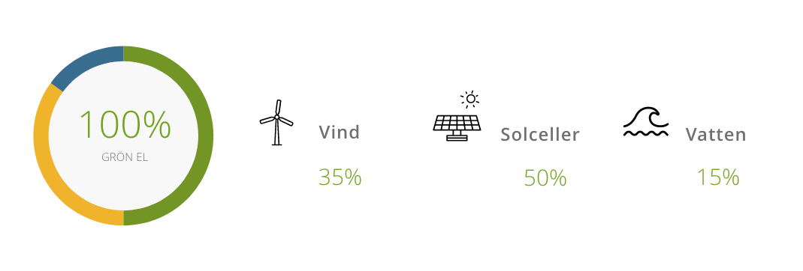

# energy-calculator
This is a new app for energy calculation

                        

                        

                        

                            

                                <h1 style="margin-top:4%; position: absolute; margin-left:18%;" class="u-grey-text u-left-text">ENERGIKÄLLA</h1>
                                
                            

                        

                    

